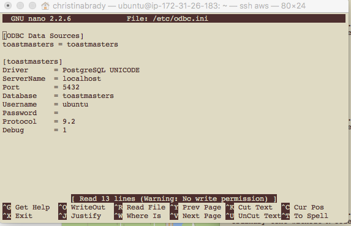

## Shiny + Databases

> 1. Setting up your DB
> 2. Connecting to it via R
> 3. Calling from and saving to your DB from Shiny

--- .nobackground .centrepre &vcenter .bigger
## MongoDB

---

## Install and Run MongoDB on MacOS

> 1. Give yourself ownership of the /usr/local folder again

> 2. Install via homebrew

> 3. Create a data directory and give proper permissions

> 4. Start the server

---

## Install and Run MongoDB on MacOS (code)

This is all in the Terminal
```
# give yourself ownership of /usr/local
sudo chown $(whoami):admin /usr/local && sudo chown -R $(whoami):admin /usr/local

# update homebrew and install Mongo
brew update && brew install mongodb

# create data directory
mkdir -p /data/db
sudo chown -R `id-un` /data/db

# start the server
mongod
```

---

## Install and Run MongoDB on Ubuntu
> 1. Install via apt-get

> 2. Start the server

---

## Install and Run MongoDB on Ubuntu (code)
This is also in the Terminal

```
# get a public key from MongoDB
sudo apt-key adv --keyserver hkp://keyserver.ubuntu.com:80 --recv 7F0CEB10
echo "deb http://repo.mongodb.org/apt/ubuntu "$(lsb_release -sc)"/mongodb-org/3.0 multiverse"

# update apt-get and install Mongo
sudo apt-get update
sudo apt-get install -y mongodb

# pin the current version so that it doesn't auto-update
echo "mongodb hold" | sudo dpkg --set-selections
echo "mongodb-server hold" | sudo dpkg --set-selections

# Start the server
sudo service mongodb start
```

---

## Connect to your MongoDB from R
> 1. Install jsonlite and mongolite
> 2. Install SSL libraries for Ubuntu
> 3. Require or library jsonlite and mongolite
> 4. Open a connection
> 5. Call or save data

---

## Connect to your MongoDB from R (code)
In Terminal (if necessary)
```
sudo apt-get libssl-dev
sudo apt-get libsas12-dev
```
In R
```
install.packages(c("jsonlite", "mongolite"))
library(jsonlite)
library(mongolite)
```

---

## Connect to Shiny (calling data)
In db_connection.R
```
m <- mongo(collection = "dbname")
```
In global.R

```
library(jsonlite)
library(mongolite)
source("db_connection.R")
data_for_shiny <- m$find()
distinct_data <- m$distinct("name")
```

---


## Connect to Shiny (save data)
In ui.R
> 1. Create an action button

In server.R
> 1. Create a named list
> 2. Translate to JSON
> 3. Insert into your collection


---


## Saving Data (code)
in ui.R
```
actionButton(inputId = "save", label = "Save")
```

in server.R
```
observeEvent(input$save, {
  newrecipe <- list()
  newrecipe[["name"]] <- input$name
  newrecipe[["ingredients"]] <- input$ingredients
  newrecipe[["instructions"]] <- input$instructions
  newrecipe[["tags"]] <- input$tags
  m$insert(toJSON(newrecipe))
  })
```

---

## Common Problems with MongoDB
> 1. I forgot that I pinned the current version, then tried to upgrade to a newer version.
> 2. Text search in version >= 2.4


---

## PostgreSQL

---

## Install and Run PostgreSQL (MacOS/Ubuntu)
> 1. Install PostgreSQL via Installer (MacOS), hombrew (MacOS) or apt-get (Ubuntu)
> 2. Change default password
> 3. Create a new database
> 4. Create a new user
> 5. Grant the new user privileges to the database

---

## Install ODBC (MacOS)
> 1. Download psqlODBC Driver from website
> 2. Install from binary
> 3. Install driver manager (iodbc, unixodbc)

---

## Install ODBC (MacOS: code)
In Terminal:
```
cd path/to/psqlodbc-09.06.0200/
./configure
make
sudo make install
```
Install Driver Manager (in Terminal)
```
brew update && brew install unixODBC
```

---

## Install ODBC (Ubuntu)
> 1. Install unixODBC from apt-get
> 2. Install odbc-postgresql from apt-get

---

## Install ODBC (Ubuntu: code)
In Terminal:
```
sudo apt-get install unixODBC unixODBC-dev
sudo apt-get install odbc-postgresql

```

---


## Configure your ODBC connection (MacOS/Ubuntu)
> 1. Find your odbcinst.ini and odbc.ini
> 2. Configure your driver
> 3. Set up a connection to a database
> 4. Test your connection

---

## Configure your ODBC connection (MacOS/Ubuntu: code)
In Terminal
```
odbcinst -j
```
Once you find them
```
sudo nano path/to/odbcinst.ini
sudo nano path/to/odbc.ini
```
Once everything is set up
```
isql -v dbname db_username db_password
```

---

## This is what it should look like (MacOS/Ubuntu)
Find ODBC Files


---

## This is what it should look like (MacOS/Ubuntu)
odbninst.ini


---

## This is what it should look like (MacOS/Ubuntu)
odbc.ini




---

## This is what it should look like (MacOS/Ubuntu)
isql


---

## Connect to your PostgreSQL DB via R
> 1. Download and install RODBC
> 2. Open a connection

---

## Install RODBC (MacOS: code)
[Download here] (https://cran.r-project.org/web/packages/RODBC/index.html)

In Terminal
```
R CMD INSTALL path/to/RODBC...tar.gz
```

---

## Install RODBC (Ubuntu: code)
In Terminal
```
sudo apt-get install r-cran-rodbc
```

---

## Open a connection

In R
```
library(RODBC)
odbcDataSources()
db <- odbcConnect("dbname")
```

---

## Connect to Shiny (calling data)
In db_connection.R
```
library(RODBC)
dbobject <- odbcConnect("dbname", uid = "userid", pwd = "password")
```
In global.R

```
source("db_connection.R")
shiny_data <- sqlQuery(dbobject, "SELECT col1, col2, col3 FROM dbname WHERE col1 = 'x'")
```

---


## Connect to Shiny (save data)
In ui.R
> 1. Create an action button

In server.R
> 1. Create a dataframe
> 2. Insert into your collection

---

## Saving Data (code)
in ui.R
```
actionButton(inputId = "save", label = "Save")
```

in server.R
```
observeEvent(input$save, {
  attendance <- data.frame(
    meeting_date = Sys.Date(),
    role = input$role,
    member = input$name)
    sqlSave(dbobject, attendance, "dbattendance", append = TRUE, varTypes = c(meeting_date = "date", role = "varchar", member = "varchar"), colnames = FALSE, rownames = FALSE)
    )
  })
```

---

## Common Problems with PostgreSQL
> 1. There are 2 possible driver managers for ODBC


---

## Resources
[Installing MongoDB on Mac] (http://treehouse.github.io/installation-guides/mac/mongo-mac.html)
